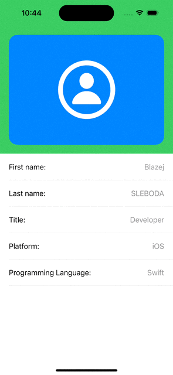

[](https://swiftpackageindex.com/Adobels/UIViewKit)
[](https://swiftpackageindex.com/Adobels/UIViewKit)

# UIViewKit

UIViewKit lets you build UIKit views directly in code with a syntax that feels like SwiftUI.
It provides a DSL powered by @resultBuilder for both UIView hierarchies and NSLayoutConstraints, so you can create entire UIViewController scenes in strongly typed Swift - without relying on storyboards or XIBs.

## Key Features

- **DSL with @resultBuilder for UIKit** - Build UIView hierarchies in Swift using a declarative, SwiftUI-like syntax. With builders like ibSubviews, ibAttributes, and ibApply, your code becomes compact, expressive, and easy to read.

- **Constraint Generator** - Define AutoLayout with ibConstraints for fast, expressive, and compact constraint definitions.

- **FreeForm Preview** - Instantly preview UIKit views and controllers with live constraint evaluation. Test layouts across multiple device sizes without leaving Xcode.


## How to Use

### "Hello, World!"

```swift
import UIViewKit

class ViewController: UIViewController {
        
    override func viewDidLoad() {
        super.viewDidLoad()
        view.ibSubviews {
            UILabel().ibAttributes {
                $0.centerXAnchor.constraint(equalTo: view.centerXAnchor)
                $0.centerYAnchor.constraint(equalTo: view.centerYAnchor)
                $0.text = "Hello, world!"
            }
        }
    }
}
```

### Defining ViewController's View, Complex

```swift
final class ViewController: UIViewController {

    private var profileItems: [(title: String, value: String)] = [
        ("Framework: ", "UIViewKit"),
        ("Platform: ", "iOS"),
        ("Programming Language: ", "Swift"),
        ("Device:" , "Simulator"),
        ("FreeForm Preview:" , "UIKit, SwiftUI"),
    ]

    private var headerView: UIStackView!

    override func loadView() {
        super.loadView()
        view.ibSubviews {
            UIStackView(axis: .vertical, alignment: .fill).ibOutlet(&headerView).ibSubviews {
                UIImageView().ibAttributes {
                    $0.widthAnchor.constraint(equalTo: $0.heightAnchor).ibPriority(.required)
                    $0.image = .init(systemName: "person.circle")
                    $0.contentMode  = .scaleAspectFit
                    $0.tintColor = .white
                    $0.layer.cornerRadius = 20
                    $0.backgroundColor = .systemBlue
                }
            }.ibAttributes {
                $0.leadingAnchor.constraint(equalTo: view.leadingAnchor)
                $0.topAnchor.constraint(equalTo: view.topAnchor)
                $0.trailingAnchor.constraint(equalTo: view.trailingAnchor)
                $0.backgroundColor = .systemGreen
                $0.layoutMargins = .init(top: 20, left: 20, bottom: 20, right: 20)
                $0.isLayoutMarginsRelativeArrangement = true
            }
            UIStackView(axis: .vertical).ibSubviews {
                for item in profileItems {
                    RowView().ibAttributes {
                        $0.titleLabel.text = item.title
                        $0.valueLabel.text = item.value
                    }
                }
                UIView()
            }.ibAttributes {
                $0.topAnchor.constraint(equalTo: headerView.bottomAnchor)
                $0.leadingAnchor.constraint(equalTo: view.leadingAnchor)
                $0.trailingAnchor.constraint(equalTo: view.trailingAnchor)
                $0.bottomAnchor.constraint(equalTo: view.safeAreaLayoutGuide.bottomAnchor)
            }
        }.ibAttributes {
            $0.backgroundColor = .systemBackground
        }
    }
}

final class RowView: UIView {

    var titleLabel: UILabel!
    var valueLabel: UILabel!

    required init?(coder: NSCoder) {
        fatalError()
    }

    override init(frame: CGRect) {
        super.init(frame: frame)
        self.ibSubviews {
            UIStackView(axis: .vertical).ibSubviews {
                UIStackView(axis: .horizontal, spacing: 10).ibSubviews {
                    UILabel().ibOutlet(&titleLabel)
                    UILabel().ibOutlet(&valueLabel).ibAttributes {
                        $0.textColor = .systemGray
                        $0.textAlignment = .right
                    }
                }
                UIView().ibAttributes {
                    $0.heightAnchor.constraint(equalToConstant: 1)
                    $0.backgroundColor = .separator
                }
            }.ibAttributes {
                $0.leadingAnchor.constraint(equalTo: layoutMarginsGuide.leadingAnchor)
                $0.topAnchor.constraint(equalTo: topAnchor)
                $0.trailingAnchor.constraint(equalTo: layoutMarginsGuide.trailingAnchor)
                $0.bottomAnchor.constraint(equalTo: bottomAnchor)
                $0.heightAnchor.constraint(equalToConstant: 66)
            }
        }
    }
}
```

## IBFreeForm Preview Demo

```swift
import SwiftUI

#Preview {
    IBFreeForm {
        ViewController()
    }
 }
```



## 📖  Documentation
- ibSubviews - Define the hierarchy of views, similar to Interface Builder's Document Outline. When applied to a UIStackView, the DSL uses the `addArrangedSubview` method
- ibAttributes - Configure attributes and constraints of a view. This corresponds to Interface Builder’s Identity, Attributes, Size, and Connections Inspectors.

⚠️ When defining a constraint, either the first or second item must be the same view to which you are applying ibAttributes.

- ibApply - Similar to ibAttributes, but without a @resultBuilder for constraints — useful for custom configurations, it works with NSObject and UIView
- IBFreeForm - Wraps a UIView, UIViewController, or even a SwiftUI.View, allowing resizing in the simulator. You can also define a snapFrame to display frames of specific devices (e.g., iPhone SE).
- IBDebug - Provides showColors, showFrames to help visualize layout frames during debugging. Works only with UIKit.
